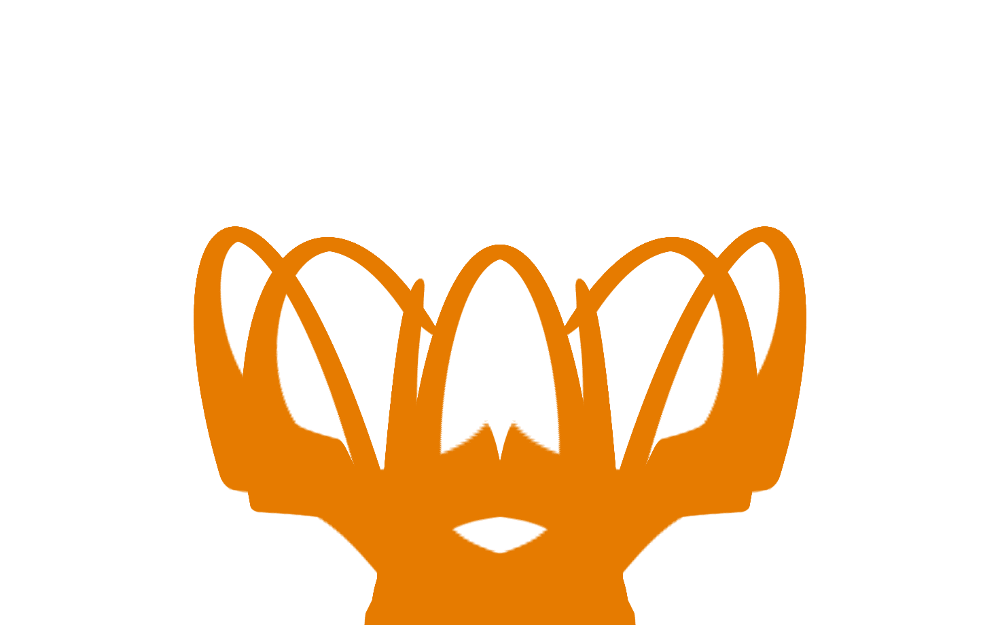
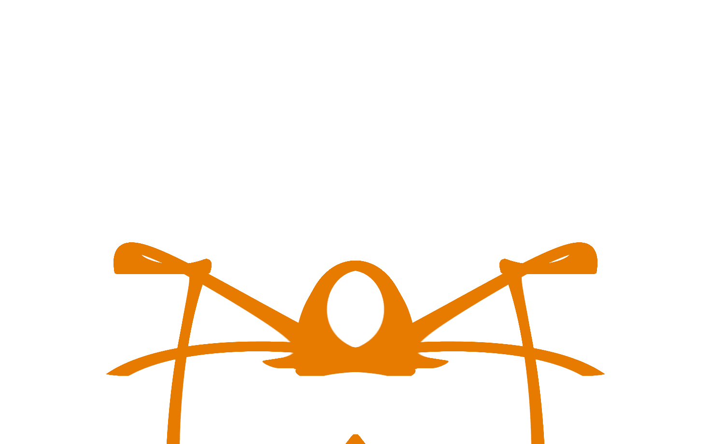
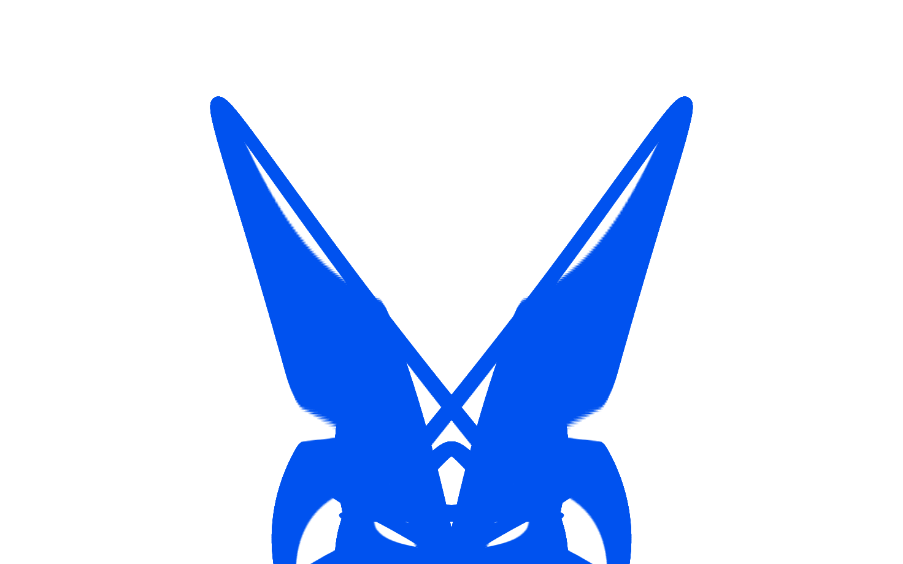
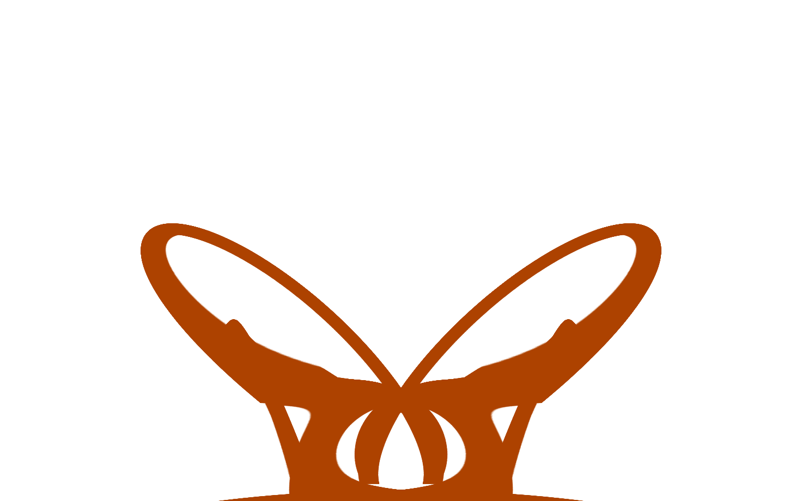

# Spinblot

This is a random image generator based on a bug in an old line drawing library.

A chain of segments spins around each link at a random speed, painting the
topmost parts of the line on to a canvas as it moves. The result is a symmetric
abstract-looking image which varies significantly with small changes to the
initial rotation speeds. It is similar in appearance to a
[Rorschach "inkblot" test](https://en.wikipedia.org/wiki/Rorschach_test).

## Examples

